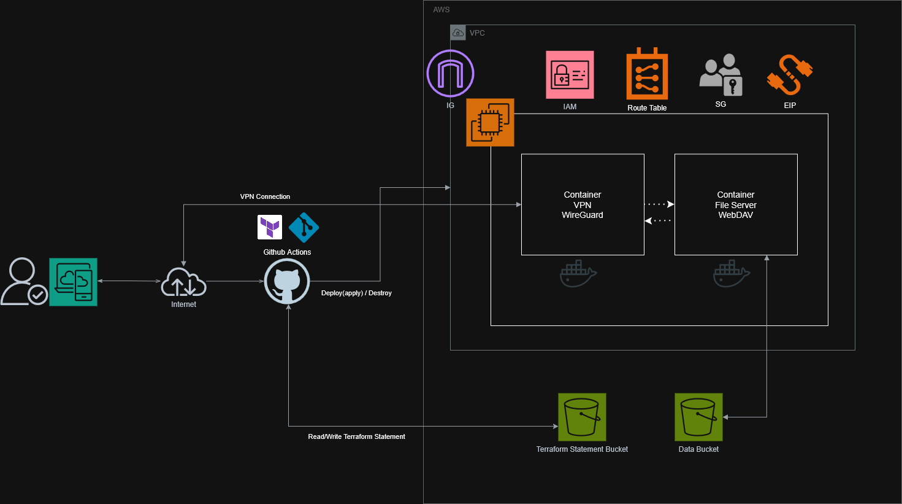

# secure-webdav-on-aws

VPN(WireGuard)를 통해 접속하여 안전하게 내부의 데이터에 접근할 수 있는 파일 서버 시스템<br>


## Overview

| Item | Detail |
|---|---|
| VPN | WireGuard |
| File Server | Apache (mod_dav) |
| Container | Docker / Docker Compose |
| Infrastructure as Code(IaC) | Terraform |
| Storage | Amazon S3 Files (NFS mount) |
| CI/CD | GitHub Actions |


## Architecture

<<<<<<< HEAD

=======

>>>>>>> d178706bbace83bda57f8a88d099e3aed7f30597

### 왜 이러한 디자인으로 했는가?

**WireGuard over OpenVPN**  
openVPN보다 설정이 단순하며 빠르기 때문에 WireGuard를 선택<br>

**Apache mod_dav over Nginx + dav-ext**  
아파치 내장 모듈 중 mod_dav 모듈은 기본적인 제공 서비스로 필요한 파일 서버로서의 기능을 만족하므로 사용<br>
VPN 컨테이너에 연결하지않으면 접속할 수 없기 때문에 WebDAV와 VPN 컨테이너 간 통신은 비암호화 방식으로 진행<br>

**S3 Files**  
이전의 권장 사항 대로라면 다수의 ECS 컨테이너에 마운트 할 수 있는 볼륨으로서는 EFS가 추천되었지만,<br>
S3 Files가 네이티브 NFS 볼륨으로 마운트 가능하게 되었다(GA April 2026).<br>
아래 두 가지 이유 때문에 EFS를 제외하고 S3 Files를 채택<br>

(1) 항상 사용하기 보다 가끔 사용하기에 적합<br>
(2) 비용이 저렴함<br>

**EC2**  
ECS Fargate를 처음에는 생각했으나 콜드 스타트를 피할 수 없다.<br>
파일 서버에 접속하기 위해서 리소스 접속, 리소스 생성 대기, ECS 기동 대기의 흐름을 모두 기다리면 수 분이상 기다려야하기 때문에<br>
ECS Fargate가 아닌 EC2(micro 모델)을 선택하여 필요에 의해 배치할 수 있는 온디맨드형 시스템을 구축했다<br>

---

## Repository Structure

```
secure-webdav-on-aws/
├── github
|   └── workflows
|       └──terraform_manual.yml
├── docker/
│   ├── wireguard/
│   │   └── Dockerfile
│   └── webdav/
│       └── Dockerfile
├── terraform/
│   ├── main.tf
│   ├── variables.tf
│   └── outputs.tf (Optional)
├── docker-compose.yml 
└── README.md
```

## Getting Started

이후 작성 예정

## Cost Management

필요한 경우에만 사용할 수 있도록 Github Actions를 통하여 Workflow를 실행함으로서<br>
클릭 한 번에 리소스를 배치할 수 있도록 함<br>


## Connecting a Client

추가 예정


## Troubleshooting

### 1. wireguard 컨테이너에서 webdav 호스트명을 찾지 못함
원인: docker-compose.yml 에서 wireguard 컨테이너에 networks 설정 누락<br>
해결: wireguard 서비스에 vpn_network 추가(동일한 네트워크로 구성)<br>

### 2. WebDAV 접속시 500 에러
원인: .htpasswd 파일 미생성<br>
해결: entrypoint.sh 에서 컨테이너 시작시 htpasswd 명령어로 자동 생성<br>
`htpasswd -cb /usr/local/apache2/conf/.htpasswd "$WEBDAV_USER" "$WEBDAV_PASSWORD"`

### 3. WebDAV 접속시 301 리다이렉트
원인: URL 끝에 슬래시 누락 `docker exec -it wireguard curl -u admin:changeme http://webdav:80/webdav` <br>
해결: /webdav/ 로 접속<br>

### 4. WebDAV 파일 업로드시 500 에러 (DBM 드라이버 문제)
원인: Alpine 3.13 이후 apr-util-dbm_db 패키지가 제거됨<br>
    DavLockDB 가 의존하는 DBM 드라이버를 로드할 수 없음<br>
해결: httpd:2.4-alpine → httpd:2.4 (Debian) 로 베이스 이미지 교체<br>

### 5. WireGuard 연결시 내부 통신 외 통신 불가 현상(로컬 테스트 도중)
원인: Docker 브리지 네트워크 대역(192.168.0.0/24)과 VPN 내부 대역(10.13.13.0/24)과 맞지 않음<br>
    WireGuard의 허용 IP에서 도커 브리지 네트워크로 갈 수 있는 설정이 존재하지 않았음<br>
해결: 도커 브리지 네트워크 대역에서 로컬 네트워크 대역과 충돌할 수 있는 가능성을 피하기 위해 172.28.0.0/24 로 변경<br>
    VPN 클라이언트가 10.13.13.1(VPN 서버IF)에 webdav/ 요청을 하면 WireGuard 서버가 WebDAV 서버로 라우팅을 하도록 변경 `iptables -t nat -A PREROUTING -i wg0 -p tcp --dport 80 -j DNAT --to-destination 172.28.0.201:80`<br>
    => WireGuard 서버에 WebDAV 서버에 대해서 등록(라우팅)하는 규칙을 생성해서 해결

### 6. AL2023에서의 Docker builx 업그레이드
AL2023에서는 Docker builx가 Docker Compose를 실행할 수 있는 최소 버전을 충족시키지 못함<br>
그러므로 USER DATA으로부터의 도커 실행이 실패하고 있었음<br>
curl 명령어로 직접파일을 다운로드 받아 적용시켜서 해결함
<br>
https://github.com/amazonlinux/amazon-linux-2023/issues/1032#issuecomment-3874686692<br>

### 7. Github Actions 와의 통합
이전 버전의 커밋에서는 로컬에 존재하는 Terraform 파일로 로컬에서 암호나 시크릿 키를 직접 변수 파일로 작성했으나<br>
다른 환경에서 작업할 경우 해당 파일을 공유해야하므로 보안적 문제와 유지보수의 문제가 발생할 것을 우려함.<br>
Github Actions과 통합해서 필요한 변수는 Repository Secrets를 통해 받아오도록 저장하고, 필요할 때 직접 트리거하여 리소스를 생성할 수 있도록 구성함<br>
기존 비공개로컬파일에서 값을 읽어오는 방식에서 저장된 변수를 workflow에서 받아와서 테라폼을 실행하도록 함<br>

### 8. OIDC의 적용
Github Actions에서는 멀티 클라우드(AWS 등)와의 연계에서 GitHub OIDC(OpenID Connect)를 사용할 것을 권고하고 있음<br
액세스 키 또는 시크릿 키가 탈취되면 거의 모든 권한을 가질 수 있는 가능성이 있으며, 키가 노출되면 무기한 인프라 탈취도 가능하므로 우려해야하는 부분이기도 하다<br>
그러므로 JWT 토큰을 사용한 단기 유효 자격 증명으로 리포지토리, 브랜치별 제어가 가능한 권한으로 움직이게 끔 함<br>
<br>
이번 프로젝트에 적용하기 위해서 AWS의 IAM에서 'ID 제공업체'(IAM provider)에 github actions를 등록 후 필요한 리소스에 대한 권한을 위해 IAM 역할을 부여했다<br>
이후 Repository Secrets에 역할의 ARN, 리전에 대한 값을 저장해서 사용함<br>

### 9. tfplan 의 패스 설정, 의존성, 체크섬 해결
`Terraform init`, `Terraform plan` 시 생성되는 파일은 Github Actions 가상머신의 /Terraform 아래에 다운로드 되도록 설정되어 있으므로 terraform 관련 명령어에는 working-directory: terraform 으로 실행 위치를 지정.<br>
<br>
`Terraform apply` 시, .terraform.lock.hcl 파일을 참조하여 프로바이더와 모듈의 정확한 버전 및 체크섬을 확인하지만<br>
이 체크섬 버전에서 가상머신 OS에 대한 정보가 없어서 시작할 때 에러가 발생.<br>
윈도우x64, 리눅스x64의 체크섬을 추가하여 정상적으로 읽어올 수 있도록 해결함

### 10. Terraform apply/destroy 간의 상태 파일 연계
현재 어떠한 리소스가 생성되어 있는지 또는 삭제되어 있는지를 알지 못하면 Terraform은 새로운 리소스를 생성하거나 삭제하려다가 에러를 발생시킨다<br>
이를 해결할 수 있는 방법으로 S3 버킷에 Terraform 전용 상태 파일을 저장하는 것이었다(state.tfstate)<br>
<br>
"terraform-backend-[리포지토리 이름]" 형식으로 버킷을 작성해 연결해주어 상태파일을 관리할 수 있도록 함<br>

## Future Improvements

- [ - ] 로컬 PC 에서 구축 후 외부에서 연결
- [ - ] WireGuard 피어 키 자동 생성
- [ ○ ] ~~Lambda + API Gateway로 ON/OFF 가능한 엔드포인트 작성~~ → Github Actions 에서 간단히 ON/OFF 가능하도록 구현
- [ - ] 스토리지 자동 백업